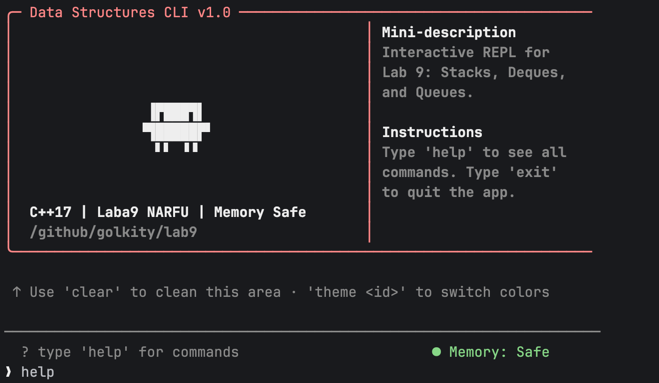

# Laba 9 Data Structure(Deque, Stack, Queue)

## Реализация CLI


## Run
>[!IMPORTANT]
> **Git clone**
>```shell
> git clone git@github.com:CS151512/HW_laba_9.git
>```
>**MakeFile**
>```shell
> run: main
>```
> **Shell**
>```shell
> c++ src/main.cpp src/stack_module.cpp src/deque_module.cpp src/queue_module.cpp -o main
>```
> **Run build cpp file**
>```
>./main
>```
